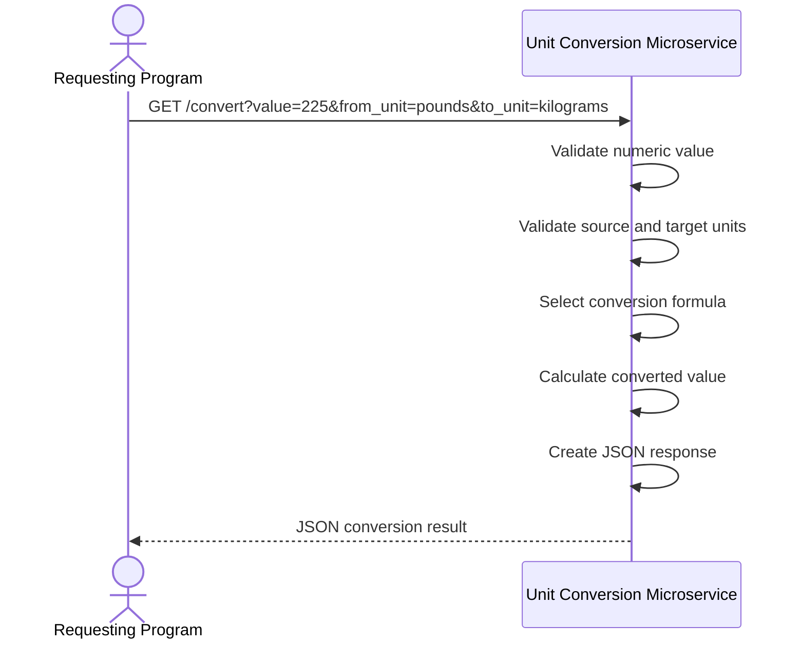

# Unit Conversion Microservice

CS361 microservice that converts values between units over a REST API with JSON.

## Assigned teammates

- Saugat
- Yelyzaveta
- Tristin
- Jacob

## Communication pipe

Other programs submit a value, source unit, and target unit. The service calculates the conversion and returns the result as JSON.

### How other programs request data

Send a **GET** request to `/convert`.

Example:

```bash
curl "http://localhost:5003/convert?value=10&from=ft&to=m"
```

Query parameters:

| Param | Meaning |
|-------|---------|
| `value` | Number to convert |
| `from` | Source unit |
| `to` | Target unit |

### Weight conversions 

The service also supports weight conversions: pounds, kilograms, ounces, and grams. Use `from_unit` and `to_unit` for these.

Example request:

```python
import requests

response = requests.get(
    "http://localhost:5003/convert",
    params={
        "value": 225,
        "from_unit": "pounds",
        "to_unit": "kilograms",
    },
)
print(response.json())
```

Example response:

```json
{
  "original_value": 225.0,
  "original_unit": "pounds",
  "converted_value": 102.06,
  "converted_unit": "kilograms"
}
```

## UML sequence diagram

How another program requests and receives a conversion result:



## How to run

1. Python 3.10+
2. From this folder:

```bash
pip install -r requirements.txt
python app.py
```

Service runs on `http://localhost:5003`.

## Project status

Starter scaffold with a small length-conversion table. Teammates should expand supported units and categories (weight, volume, temperature, etc.).
